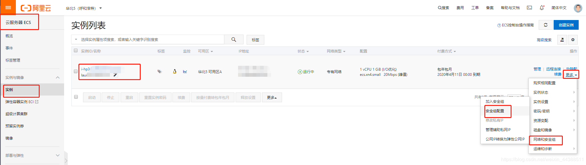
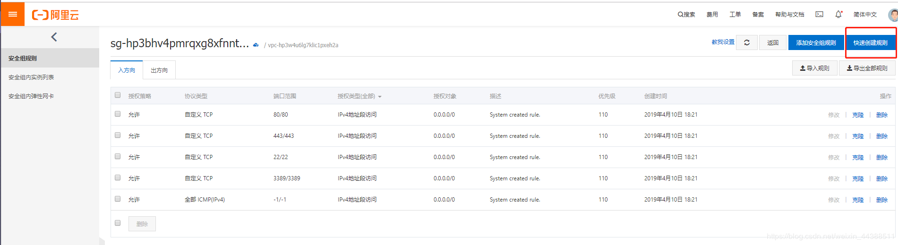

OpenFogOS需要服务器开放端口的范围为：49152~49202

阿里云端口开放方法：

1. 进入阿里云控制台，选择云服务器，选择实例，找到运行OpenFogOS的云服务器，选择更多 > 网络和安全组 > 安全组配置              

2. 进入后点击配置规则。

3. 点击右上方的快速创建规则。

4. 自定义端口选择 TCP 端口范围填写 49152/49202 授权对象填写  0.0.0.0/0 点击确定。
再次点击快速创建规则，选择UDP 端口范围填写 49152/49202 授权对象填写  0.0.0.0/0 点击确定。

5. 设置完成如图所示两条规则。

6. 选择出方向，阿里云一般默认出方向端口全部开启，所以无需额外设置。
若出方向端口被限制，同入方向的设置一样，选择快速创建规则，规则方向改为初方向，其他填写项不变。
自定义端口选择 TCP 端口范围填写 49152/49202 授权对象填写  0.0.0.0/0 点击确定。
再次点击快速创建规则，选择UDP 端口范围填写 49152/49202 授权对象填写  0.0.0.0/0 点击确定。

