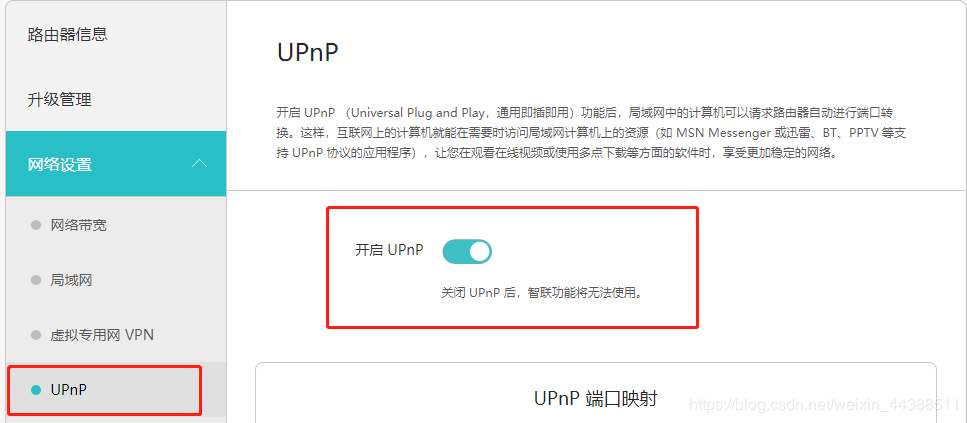

- 光猫设置为桥接模式。

一般位于光猫管理后台：
网络 > 宽带设置  > Internet连接 
- 路由器拨号上网：

一般位于路由器管理后台：
路由设置 > 上网设置
- 开启上级路由的UPnP

一般位于路由器管理后台：
网络设置 > UPnP
- 设置上级路由的NAT类型为全锥型（Full Clone）或端口限制型(Port Restricted）。

一般在路由器管理后台：
网络设置 > IPv4信息
