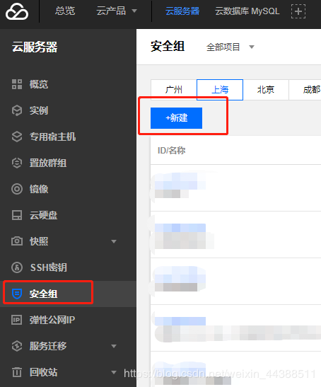
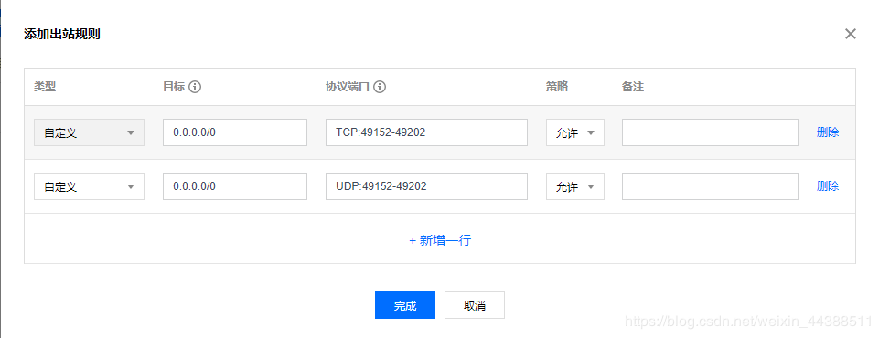

OpenFogOS需要服务器开放端口的范围为：49152~49202

腾讯云端口开放方法：
1. 在腾讯云的控制台选择云产品 > 云服务器。

2. 在云服务器界面选择安全组 > 新建 。

3.  点击新建后会自动弹出新建安全组的窗口，模板选择自定义，名称填写为OpenFogOS。

4. 新建后会自动提示设置安全组规则，点击立即设置规则。

5. 在安全组规则 > 入站规则 点击添加规则。

6. 在弹出的窗口中类型   自定义，来源  0.0.0.0/0 协议端口  TCP:49152-49202  策略  允许
再点击新增一行，类型   自定义，来源  0.0.0.0/0  协议端口 UDP:49152-49202  策略  允许

7. 如图所示即为入站规则设置成功。

8. 点击出站规则 > 添加规则

9. 同入站规则填写：
类型   自定义，来源  0.0.0.0/0 协议端口  TCP:49152-49202  策略  允许
类型   自定义，来源  0.0.0.0/0  协议端口 UDP:49152-49202  策略  允许 

10. 如图所示即为出站规则设置完成。

11. 关联云主机。
点击页面上方的 关联实例 -> 新增关联

12. 在弹出的窗口的左侧选择需要加入OpenFogOS计划的机器，选择完成后点击确定。

13.  如图所示即为腾讯云服务器开启端口成功。

